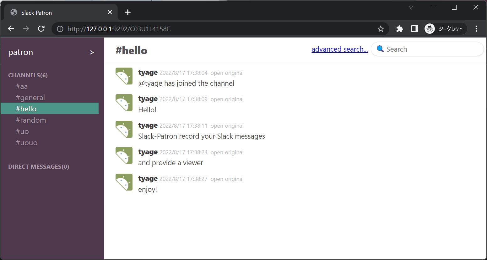

# Slack patron

<a href="https://hub.docker.com/r/tyage/slack-patron-viewer"></a>
<a href="https://hub.docker.com/r/tyage/slack-patron-logger"></a>
<a href="https://hub.docker.com/r/tyage/slack-patron-connector"></a>
<a href="https://hub.docker.com/r/tyage/slack-patron-elasticsearch"></a>

- Record Slack messages in MongoDB.
  - You can also import data from backup file.
- Web interface for searching messages.



# Quick Usage

1. Install Slack Patron App and get access token for your Slack workspace

<https://slack-patron.herokuapp.com/>

2. Run `docker compose up` with [./docs/docker-compose-quick.yml](./docs/docker-compose-quick.yml)

```sh
$ wget https://raw.githubusercontent.com/tyage/slack-patron/master/docs/docker-compose-quick.yml
$ export SLACK_PATRON_SLACK_TOKEN=[YOUR TOKEN HERE]
$ docker compose -f ./docker-compose-quick.yml up
```

3. Visit http://localhost:9292

# Docs

- [./docs/DEVELOPMENT.md](./docs/DEVELOPMENT.md): for development
- [./docs/BACKUP_IMPORT.md](./docs/BACKUP_IMPORT.md): for import Slack backup file

# Special Thanks

This product receives a lot of contribution from [TSG](https://github.com/tsg-ut) :heart:

<https://github.com/tsg-ut/slack-patron>
